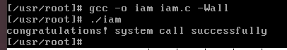
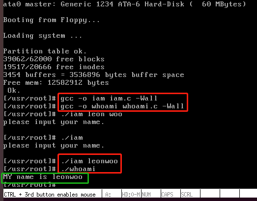

## 系统调用sys_iam()整体思路图
.png)

### 1:修改linux-0.11/include/unistd.h
插入这两行 
#define __NR_iam        72 
#define __NR_whoami   	73 
### 2:查看linux-0.11/kernel/system_call.s

修改系统调用的总数 
nr_system_calls = 74 
 
.globl system_call 
system_call: 
 #关键语句 
call sys_call_table(,%eax,4)   #eax 中放的是系统调用号，sys_call_table 一定是一个函数指针数组的起始地址，定义在 include/linux/sys.h 中 
### 3:修改linux-0.11/inclue/linux/sys.h
插入这两行 
extern int sys_iam();       
extern int sys_whoami();  
 
在sys_call_table[]数组后面加上sys_iam,sys_whoami   

### 4:编写一个文件who.c，放在linux-0.11/kernel/下
**who.c主要实现 sys_iam() 和 sys_whoami()**

### 5: 修改linux-0.11/kernel/Makefile
在OBJS后面加上who.o  
在 Dependencies:下加上以下这两行 
who.s who.o: who.c ../include/linux/kernel.h ../include/unistd.h
  ../include/asm/segment.h ../include/string.h ../include/errno.h
### 6:将修改过的内核态文件，复制到用户态下
将文件~/oslab/linux-0.11/include/unistd.h复制到路径~/oslab/hdc/usr/include下； 
将文件~/oslab/linux-0.11/include/linux/sys.h复制到路径~/oslab/hdc/usr/include/linux下。 
### 7:在用户端编写一个测试用的iam.c,验证成功实现系统调用sys_iam(),并打印出"successfully"

### 结果

