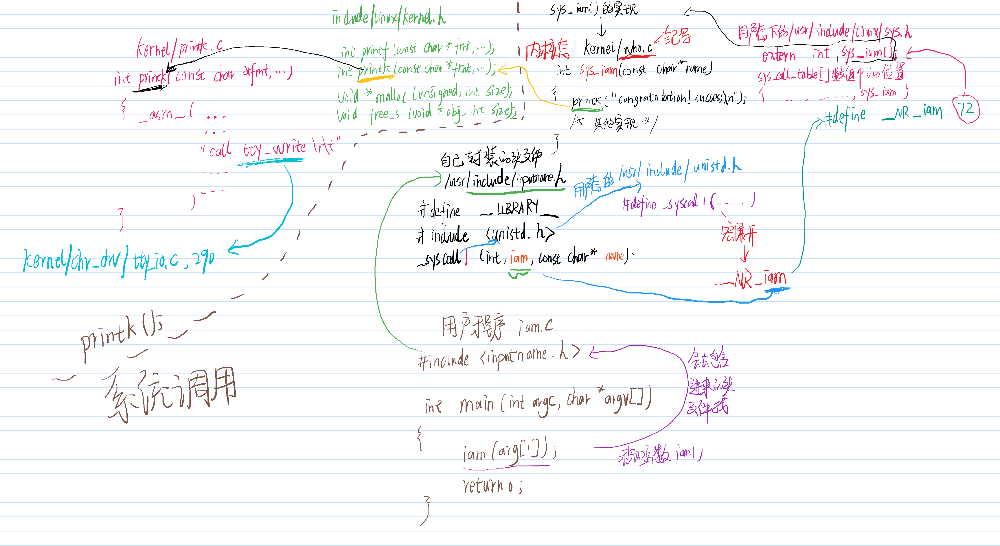
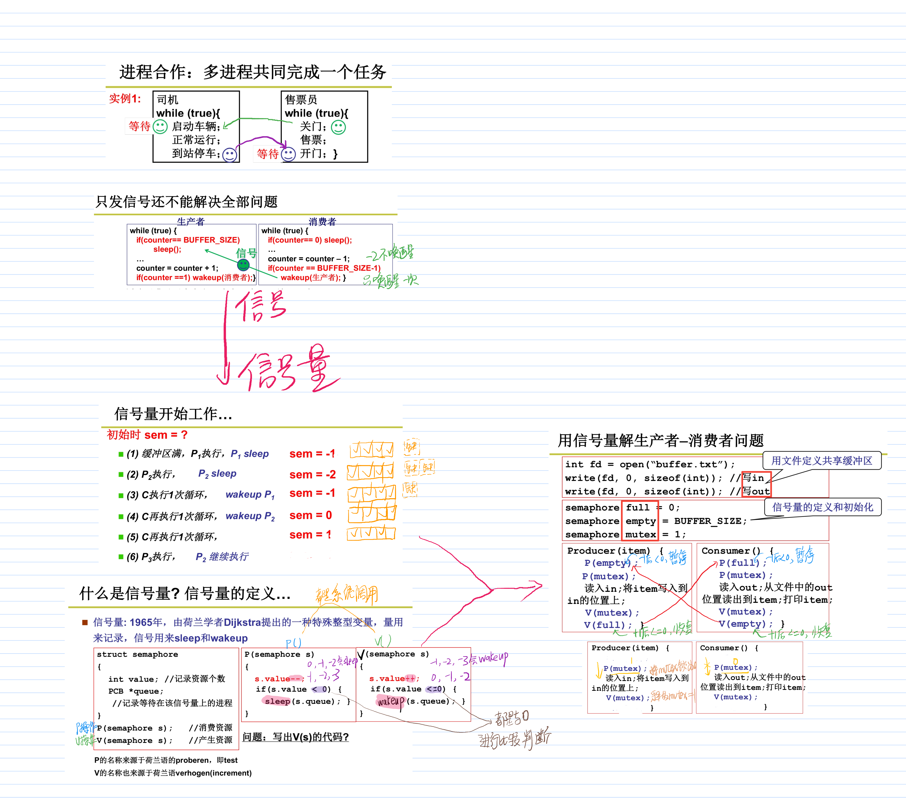
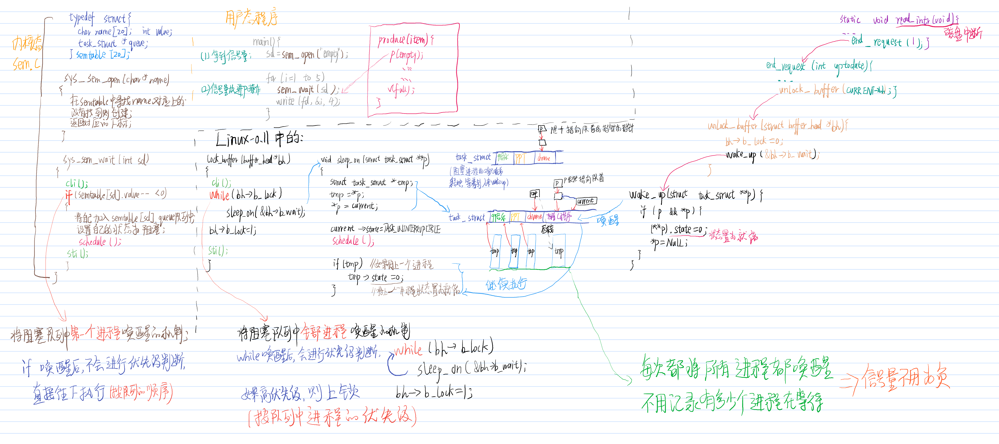

# linux0.11部分代码修改
### Exp1是对实验环境的搭建
### Exp2是对操作系统的引导，主要修改bootsect.s和setup.s
### Exp3系统调用的思路，用户态与内核态交换数据，printk（）
#### 以下是本人对linux内核的个人理解

##### linux内核对cpu的管理
1.系统调用

2.cpu调度
函数.png)
3.信号量解决消费者生产者问题

4.信号量推进

